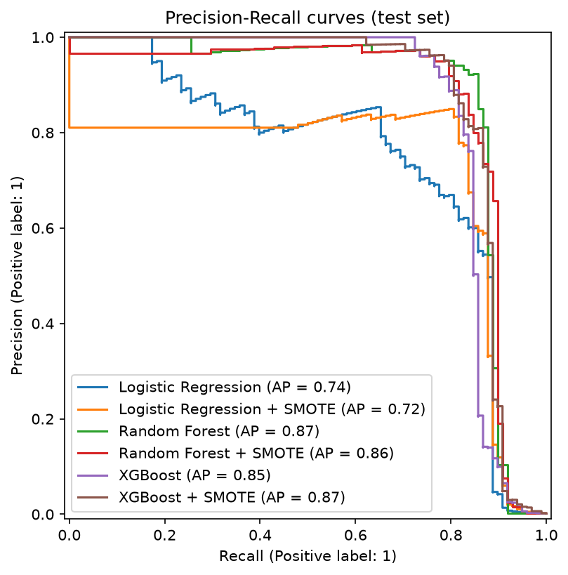
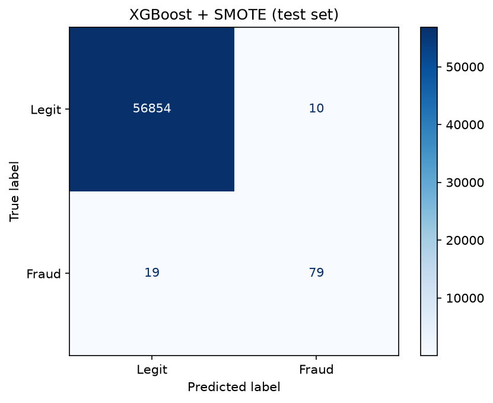

# Détection de fraude – Scoring par Machine Learning

Projet personnel. Scoring de transactions bancaires frauduleuses sur un jeu de données
fortement déséquilibré (0,17 % de fraudes).

- Pipeline de classification sur données déséquilibrées (feature engineering, SMOTE).
- Comparaison de plusieurs modèles (XGBoost, Random Forest) avec optimisation precision/recall.
- Technologies : Python, Pandas, Scikit-Learn, XGBoost.

## Données

[Credit Card Fraud Detection](https://www.kaggle.com/datasets/mlg-ulb/creditcardfraud) (ULB) :
284 807 transactions par carte sur deux jours, dont 492 fraudes. Colonnes : `Time` (secondes
depuis la première transaction), `V1` à `V28` (composantes PCA anonymisées), `Amount`, `Class`
(1 = fraude).

Le fichier n'est pas versionné. À placer dans `data/creditcard.csv` :

```bash
curl -L -o data/creditcard.csv https://storage.googleapis.com/download.tensorflow.org/data/creditcard.csv
```

## Méthode

1. **Feature engineering** : `log(1 + Amount)` (montant très asymétrique), heure de la
   transaction encodée de façon cyclique (`hour_sin`, `hour_cos`), suppression de `Time` et
   `Amount` bruts.
2. **Découpage** : 80 % entraînement / 20 % test, stratifié.
3. **Rééquilibrage** : SMOTE placé *dans* le pipeline (`imblearn.pipeline.Pipeline`), donc
   appliqué uniquement aux plis d'entraînement. Le test et les plis de validation gardent la
   distribution réelle.
4. **Modèles** : régression logistique (référence), Random Forest, XGBoost, chacun avec et
   sans SMOTE.
5. **Optimisation precision/recall** : le seuil de décision de chaque modèle est celui qui
   maximise le F2 sur les prédictions *out-of-fold* (validation croisée à 3 plis) du jeu
   d'entraînement. Le F2 pondère le rappel deux fois plus que la précision : une fraude manquée
   coûte plus cher qu'une fausse alerte.
6. **Évaluation** sur le jeu de test, jamais vu : PR-AUC (métrique principale, l'accuracy et
   le ROC-AUC étant trompeurs à 0,17 % de positifs), précision, rappel et F2 au seuil retenu.

## Résultats

Jeu de test : 56 962 transactions, dont 98 fraudes.

| Modèle | PR-AUC | ROC-AUC | Seuil | Précision | Rappel | F2 |
|---|---|---|---|---|---|---|
| XGBoost + SMOTE | 0,872 | 0,982 | 0,823 | 0,888 | 0,806 | 0,821 |
| Random Forest | 0,867 | 0,957 | 0,165 | 0,768 | 0,878 | 0,853 |
| Random Forest + SMOTE | 0,859 | 0,971 | 0,460 | 0,872 | 0,837 | 0,844 |
| XGBoost | 0,849 | 0,966 | 0,084 | 0,870 | 0,816 | 0,826 |
| Régression logistique | 0,741 | 0,960 | 0,037 | 0,607 | 0,837 | 0,778 |
| Régression logistique + SMOTE | 0,718 | 0,972 | ≈ 1 | 0,816 | 0,816 | 0,816 |

- Les modèles à base d'arbres dominent nettement la régression logistique en PR-AUC
  (0,85 à 0,87 contre 0,72 à 0,74), alors que le ROC-AUC les distingue à peine : c'est ce qui
  justifie le choix du PR-AUC.
- **XGBoost + SMOTE** a le meilleur PR-AUC : 79 fraudes détectées sur 98, pour 10 fausses
  alertes sur 56 864 transactions légitimes.
- **Random Forest sans SMOTE** a le meilleur F2 et le meilleur rappel (86 fraudes sur 98), au
  prix d'une précision plus faible.
- SMOTE n'est pas un gain systématique : il améliore le PR-AUC de XGBoost (0,849 → 0,872) mais
  dégrade légèrement celui du Random Forest et de la régression logistique.
- Avec 98 fraudes dans le jeu de test, les écarts entre les quatre modèles à base d'arbres
  restent de l'ordre du bruit d'échantillonnage.
- Sans SMOTE, les seuils optimaux sont très inférieurs à 0,5 (0,08 pour XGBoost) : le seuil
  par défaut ferait manquer des fraudes.





## Utilisation

```bash
python -m venv .venv && source .venv/bin/activate
pip install -r requirements.txt
python fraud_detection.py            # écrit reports/results.csv, pr_curves.png, confusion_matrix.png
python test_fraud_detection.py       # test rapide sur données synthétiques
```

## Limites

- Découpage aléatoire et non temporel : en production, on entraînerait sur le passé pour
  prédire le futur.
- Hyperparamètres fixés, sans recherche.
- Les variables `V1` à `V28` sont anonymisées, ce qui limite l'interprétation métier.
